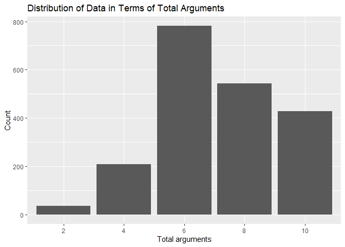
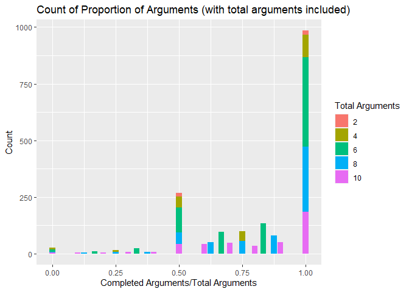
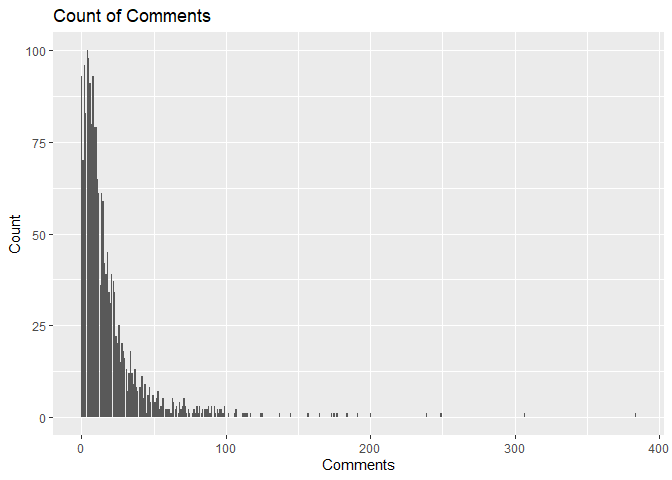

Analysis of DebateArt Data
================
BearMan
2022-07-13

This is hardly a good analysis, I was just playing with the data I
collected from a BS4 webscraper. This was also an excuse to practice my
(obviously inexperienced) R/stats skills.

Some setup needed:

``` r
library(ggplot2)

dartData <- read.csv("DART.csv")
```

## General

Finding the length of the dataset

``` r
nrow(dartData)
```

    ## [1] 1995

## Analysis of Total Arguments

The favored amount of total arguments is 6 or 3 total rounds. The least
favored is two total arguments or one total round.

``` r
ggplot(data=dartData)+
  geom_bar(mapping = aes(x=as.factor(Total.Arguments)))+
  xlab("Total arguments")+
  ylab("Count")+
  labs(title="Distribution of Data in Terms of Total Arguments ")
```

<!-- -->

## Analysis of Proportion of Arguments

Note that 1/2 is a full forfeit on one side, 0 is a full forfeit on both
sides, and 1 is a complete debate.

``` r
ggplot(data=dartData)+
  geom_bar(mapping= aes(x=Proportion.of.Arguments, fill=as.factor(Total.Arguments))) +
  xlab("Completed Arguments/Total Arguments")+
  ylab("Count")+
  labs(title="Count of Proportion of Arguments (with total arguments included)", fill="Total Arguments")
```

<!-- -->

The proportion of arguments seems to have some relation with the amount
of votes a debate garners. Debates with at least one forfeit have almost
double the amount of mean votes when compared to fully completed
debates.

``` r
forfeitRows = dartData[dartData$Proportion.of.Arguments<1,]
mean(forfeitRows$Votes)
```

    ## [1] 4.053412

``` r
nonForfeitRows = dartData[dartData$Proportion.of.Arguments==1,]
mean(nonForfeitRows$Votes)
```

    ## [1] 2.363821

A majority of debates on DART have at least one forfeit:

``` r
nrow(forfeitRows)
```

    ## [1] 1011

``` r
nrow(nonForfeitRows)
```

    ## [1] 984

## Analysis of Comments

A bar chart of the amount of comments on DART.

``` r
ggplot(data=dartData)+
  geom_bar(mapping = aes(x=Comments))+
  xlab("Comments")+
  ylab("Count")+
  labs(title="Count of Comments")
```

<!-- -->

Interestingly, the largest amount of comments on a debate is 384, which
is far higher than the mean of 18.

``` r
max(dartData$Comments)
```

    ## [1] 384

``` r
mean(dartData$Comments)
```

    ## [1] 18.55088

## Analysis of Votes

First, some simple statistics (mean and max):

``` r
mean(dartData$Votes)
```

    ## [1] 3.22005

``` r
max(dartData$Votes)
```

    ## [1] 27

### Zero Vote Debates

ZVDs make up 6% of all debates.

``` r
ZVD <- dartData[dartData$Votes==0,]
nonZVD <- dartData[dartData$Votes!=0,]
nrow(dartData[dartData$Votes==0,]) # Amount
```

    ## [1] 121

``` r
nrow(dartData[dartData$Votes==0,])/nrow(dartData) # Percentage
```

    ## [1] 0.06065163

Is this ZVD problem more prevalent in recent times, or is it an older
problem? Since this dataset is ordered in a reverse-chronological
fashion, we’ll classify the first 500 records as “recent” and everything
else as “older”.

For recent times:

``` r
recentRows <- dartData[c(0:500),] # Grab 500 most recent records
nrow(recentRows[recentRows$Votes==0,]) # Amount
```

    ## [1] 53

``` r
nrow(recentRows[recentRows$Votes==0,])/nrow(recentRows) # Percentage
```

    ## [1] 0.106

For older times:

``` r
oldRows <- dartData[-c(0:500),] # Grab everything else
nrow(oldRows[oldRows$Votes==0,]) # Amount
```

    ## [1] 68

``` r
nrow(oldRows[oldRows$Votes==0,])/nrow(oldRows) # Percentage
```

    ## [1] 0.04548495

It seems that the ZVD problem has gotten worse, as the most recent 500
debates house more than 40% of all ZVDs despite only being 25% of the
dataset.

#### Characteristics of Zero Vote Debates

ZVDs are less active than debates with votes:

``` r
mean(ZVD$Comments) # ZVD
```

    ## [1] 8.768595

``` r
mean(nonZVD$Comments) # Non ZVD
```

    ## [1] 19.1825

ZVDs are more complete than the debates with votes:

``` r
mean(ZVD$Proportion.of.Arguments) # ZVD
```

    ## [1] 0.8996556

``` r
mean(nonZVD$Proportion.of.Arguments) # Non ZVD
```

    ## [1] 0.8079509

ZVDs are longer than debates with votes:

``` r
mean(ZVD$Completed.Arguments) # ZVD
```

    ## [1] 6.479339

``` r
mean(nonZVD$Completed.Arguments) # Non ZVD
```

    ## [1] 5.774813
